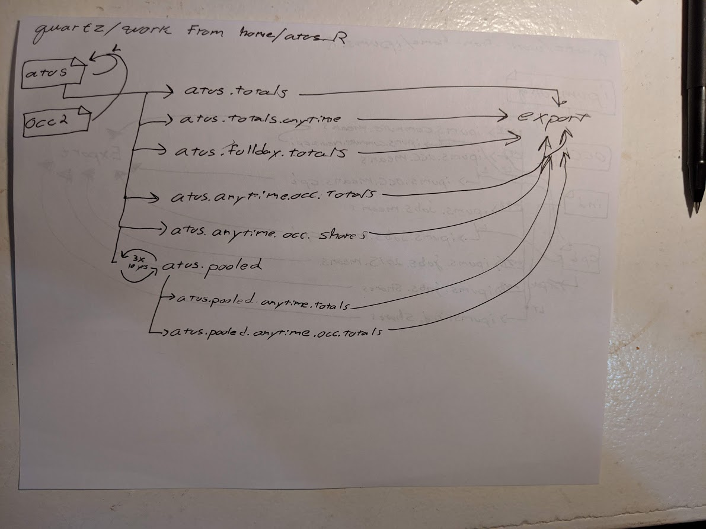

# work-from-home

Analysis of American Community Survey (ACS) and American Time Use Survey (ATUS) data describing work-from-home trends.

Data used by these scripts was exported from [IPUMS](http://ipums.org). Due to the size of the data, it is impossible to include it in the repository, however the codebooks describing the exports are included for those that wish to recreate them.

## Steve's Notes

What's interesting about this analysis is the 3-year rolling window in `atus.R`. 

TODO: I'm not exactly sure why this analysis is using a 3-year rolling window for the "pooled" data.

## What's in here

* `atus.R`: Analysis of ATUS data.
* `atus_00006.cbk.txt`: Codebook for ATUS data export.
* `ind1990.csv`: Mapping of IPUMS 1990 industry codes to their descriptions.
* `ipums.R`: Analysis of ACS data.
* `usa_00030.cbk`: Codebook for ACS data export.
* `validate-weight-math.R`: Tests run to validate that weighted calculations used in the IPUMS script produced accurate results.

## Methodology

Estimates derived from the decennial census and American Community Survey are based on the sample of full-time wage-workers (not self-employed) who reported earnings of at least $1. A worker was counted as full-time if they usually worked at least 35 hours per week. "Work from home" status was based on how respondents reported they got to work during the previous week.

Estimates derived from the American Time Use Survey are based on the sample of full-time wage-workers (not self-employed). Only observations from non-holiday weekdays were included. A worker was counted as full-time if they usually worked at least 35 hours per week. "Work from home" status was based on the amount of time respondents reported working while at their own home.